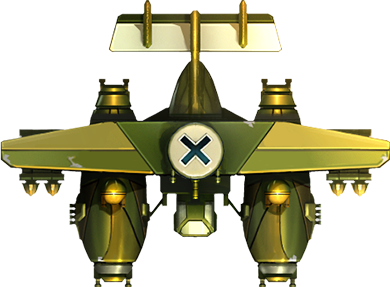
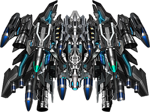
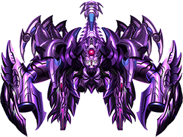
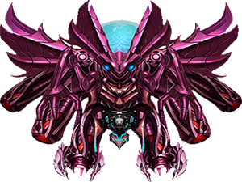
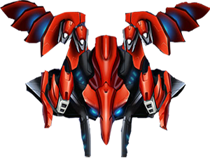

# Python Arcade Game: StormPlane
## Objectives
* The StormPlane is classical aircraft shooting game. The purpose of the game is to eliminate all the enemy planes from each game level. The more enemy planes you kill, the higher score you will get.
## Game Instructions
* In the welcome page, the battlefield would pop up the screen as the player clicks on the "Start" button.

* The aircraft will automatically shoot bullets. Players only need to use the keyboard or touchpad to change the direction of the airplane.

* The initial HP value for the player airplane is 100. This health value would get deducted based on the objects that it collides with. Every time the player airplane collides with a bullet from the enemy plane, its HP value would decrease by 5. When the player plane encounters the boss bullets, its HP value gets deducted by 20 (each bullet). If the player airplane collides with enemy plane (except for boss), its HP value would decrease by 30. As the player plane loses all of its HP, a "Game Over" message would pop up the screen, which signals to the player that the game has ended.

* There are several types of enemy airplanes. Each type has its own moving speed, HP, and attack pattern.

* The probability of generating different types of airplanes varies. There is a 50% chance of generating a small enemy plane while the probabilities of generating a medium-sized enemy plane and a large-sized enemy plane are 35% and 15% respectively.

* In the game, a variety of auxiliary props would drop from the top of the screen, such as missiles, bullets, etc. Players can enhance their weaponry through props.

* At the end of each level, the boss enemy would appear from the top of the screen after a "boss warning" prompt. During the boss battle, player must use their strategies to defeat the boss in order to level up.

* The game is divided by 4 levels. As level goes up, different attributes of enemy planes would relatively increase from the previous level. (e.x The speed of the enemy planes, HP values)

* When the player defeats the final boss at the end of level 4, a "Victory" message would pop up the screen, which signals to the victory of the game. Besides, the scoring and time would show up on the ending page.

* Rules for game props 

* Operating Instruction: Use "W" key for Up; "A" key for Left; "D" key for Right; "S" key for Down; "Z" key for Laser Shooting 

## Scoring 

* Every time a enemy plane gets killed, the player's score would increase based on the enemy airplane type. See the table below

| **Types of Enemy Planes**  | **Scoring** | **Images** |
|:---:|:---:| : --- : |
| small-sized |  10 |  |
| middle-sized  |  50 |  |
| large-sized  | 100  |  |
| boss_level_1  | 500  |  |
| boss_level_2  | 1000  |  |
| boss_level_3  | 2000  | |
| boss_level_4  | 4000  | |

* Every time the player's score increased by 1000, a star-shaped icon would show up on the screen, representing the remaining amount of laser beam.

  

