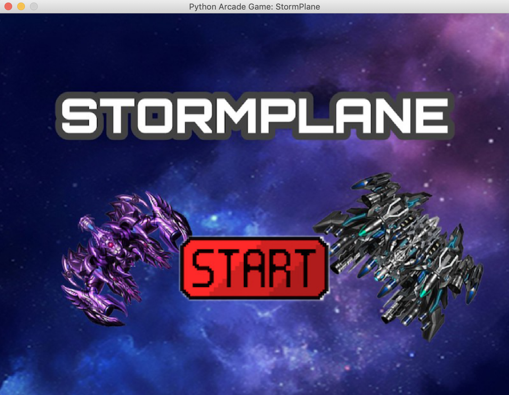

# Python Arcade Game: StormPlane
## Objectives
* The StormPlane is a simple and addicting 2D aircraft shooting game where you play the role of a brave and daring fighter pilot. Dodge and weave your way around a war zone as you try to avoid enemy fire from all angles to survive. Destroy as many enemy aircraft as you can in this adventure to get higher scores. Your final goal of this game is to get through all the levels and score as many points as possible. Good luck brave Fighter Pilot! 

## Game Instructions
* On the main menu screen, Click the "Start" button to begin.

* The aircraft will automatically shoot bullets. Players only need to use the keyboard or touchpad to navigate between enemy planes and bullets.
* The initial HP value for the player airplane is 100. This health value would get deducted based on the objects that it collides with. Every time the player airplane collides with a bullet from the enemy plane, its HP value would decrease by 5. When the player plane encounters the boss bullets, its HP value gets deducted by 20 (each bullet). If the player airplane collides with enemy plane (except for boss), its HP value would decrease by 30. As the player plane loses all of its HP, the game is over.

* There are several types of enemy airplanes. Each type has its own moving speed, HP, and attack pattern.

* The chances of generating small enemy airplanes, medium enemy airplanes, and large enemy airplanes, are 50%, 35%, and 15% respectively. 

* At the end of each level, an enemy boss would appear from the top of the screen. During the boss battle, the player must defeat the boss in order to level up.

* The game is divided into 4 levels. As the level goes up, the difficulty would also increase.

* When the player defeats the final boss at the end of level 4, the game is won.

* The HP bonus icon would drop from the top of the screen every 60s. When the player airplane catches the HP bonus, its health value would automatically increase by 30.

* Operating Instruction: Use "W" key for Up; "A" key for Left; "D" key for Right; "S" key for Down; "Z" key for Missile Shooting.

## Scoring 

* Every time a enemy plane gets killed, the player's score would increase based on the enemy airplane type. See the table below

| **Types of Enemy Planes**  | **Scoring** | **Images** |
|:---:|:---:| : --- : |
| small-sized |  10 | |
| middle-sized  |  50 |  |
| large-sized  | 100  |  |
| boss_level_1  | 500  |  |
| boss_level_2  | 1000  |  |
| boss_level_3  | 2000  | |
| boss_level_4  | 4000  | |

* Every time the player's score increased by 1000, a missile icon would show up on the screen, representing the remaining amount of laser beam.

## Screen Mock-Ups
* These are some initial screenshots of our game 

  

